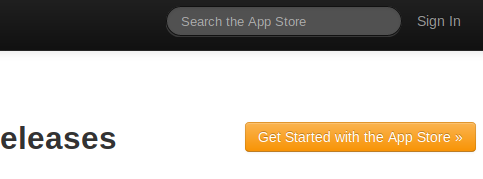
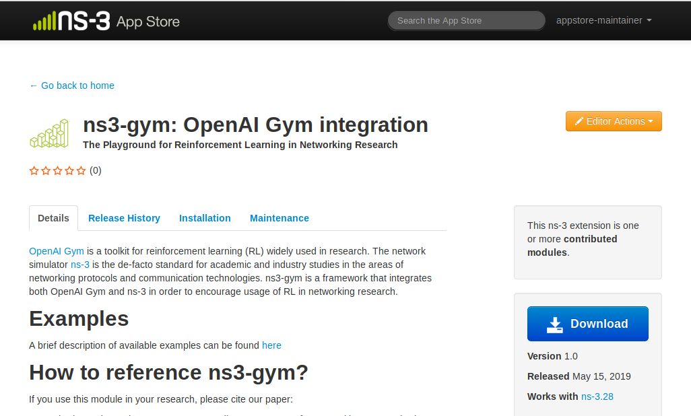
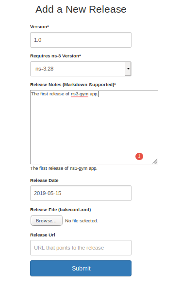
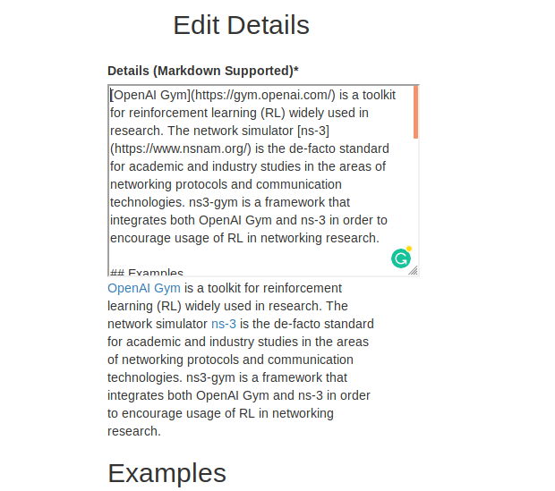
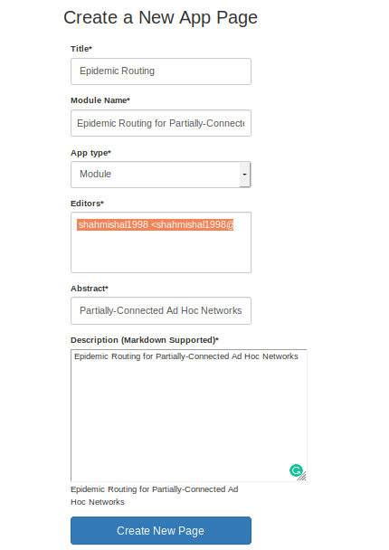
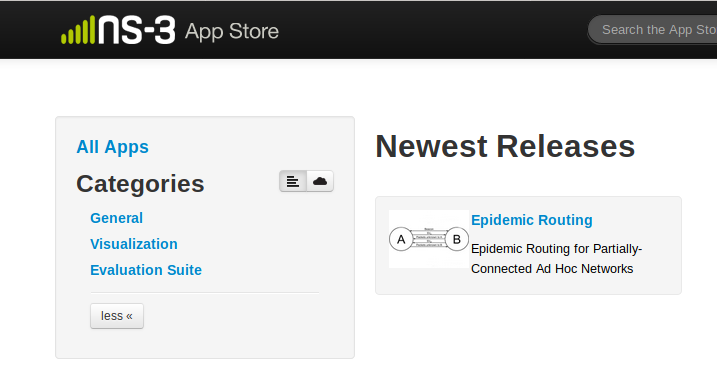
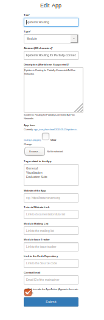

# User Guide
This section explains the User workflows in the website. This section will be useful to regular ns-3 users or developers or maintainers who interact with the website.

## What are ns-3 apps?

'Apps' is just a colloquial term for what ns-3 calls a module or a group of modules. The ns-3 app store is a browsable front-end tool for users to find modules of interest. The end result is for users to download, configure, and build the set of modules of interest.

In most scenarios (outside of ns-3), downloadable 'apps' are executable binaries or runtime plugins, and the act of downloading an app makes it immediately available for use on the user's system. ns-3, however, is distributed as source code, and the user is responsible for compiling the code. This extends also to ns-3 apps (modules); the act of downloading does not directly result in a runnable extension. Instead, installing an app means that the user has the source code available to combine with other modules, ready to build.

## ns-3 Users
ns-3 Users are the primary target audience of this App Store. Users will be able to search for different Apps/Modules available in ns-3, visit the individual App pages and download them.
- Users will be able to search for an App from the search bar located in the navbar of the website.



- Users can search for Apps based on Category, Author, Title, Abstract, and Description.
- The search results can be sorted based on Downloads, Release Date, Name and Votes.


- Users can download the App from the App Page which displays the App Details including Release History.



## ns-3 Developer

The Developers who create new Apps can use the webapp to publish their work and let users download it easily. An App can be added to the App Store once it is accepted by ns-3 maintainers.

- Once the Developer is made the editor of an App Page, he can edit the entire App Page to suit his requirements.
- The Developer can Add or Edit Releases, and Authors.


### Submit a new Release
- A new release for the app can be made, which will be reflected on the Home Page of the App



### Edit Details
- The details of the App to be displayed can be edited with this



### Installation Instructions
- The installation instructions for the App can be added 


Similary the Maintenance and Download instructions can be added.

The App Page would look similar to this:


## AppStore Maintainer

- AppStore Maintainers will manage the AppStore by adding/editing data in the Store. Maintainers will be Django ```Staff``` users and will have access to edit all the apps in the store.
- Maintainer with superuser previleges will be adding data into the backend using the Django Administration Panel. This include new ns-3 releases, new tags, etc.
- The maintainer can edit any app data if found to be misleading.

### New Apps
- Maintainers create the page for a newly accepted App and assigns editors to it.



- On going to **All Apps** from the home page



- After viewing the app, on clicking the **Editor Actions** button, they get multiple options to make changes to the App


### Edit Apps
- Edit the app if the data is found to be misleading.

