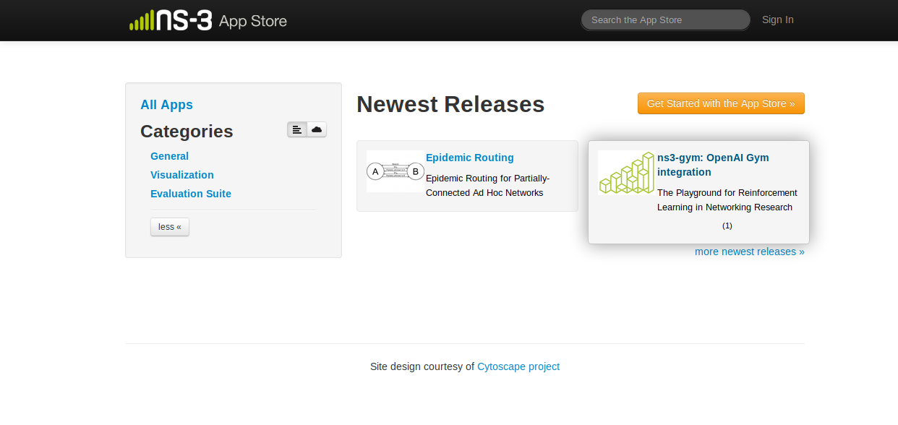
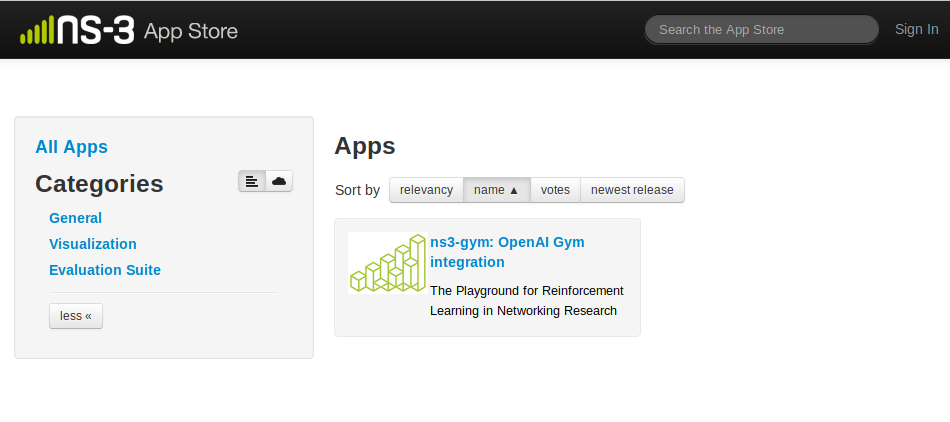
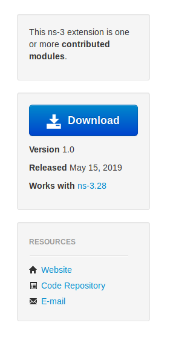
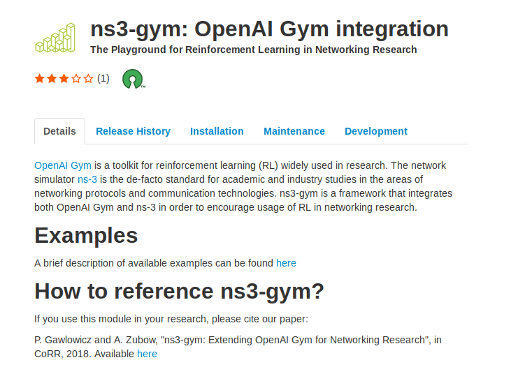
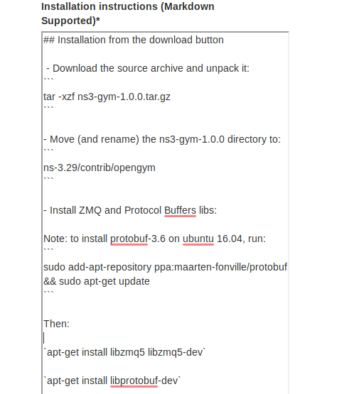
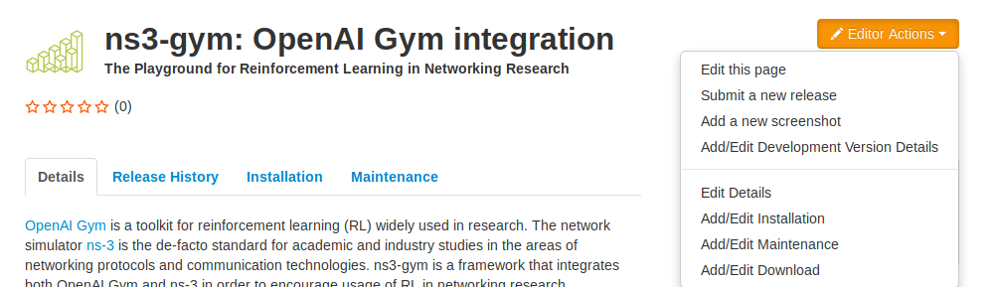

# User Guide
This section explains the User workflows in the website. This section will be useful to regular ns-3 users or developers or maintainers who interact with the website.

## What are ns-3 apps?

'Apps' is just a colloquial term for what ns-3 calls a module or a group of modules. The ns-3 app store is a browsable front-end tool for users to find modules of interest. The end result is for users to download, configure, and build the set of modules of interest.

In most scenarios (outside of ns-3), downloadable 'apps' are executable binaries or runtime plugins, and the act of downloading an app makes it immediately available for use on the user's system. ns-3, however, is distributed as source code, and the user is responsible for compiling the code. This extends also to ns-3 apps (modules); the act of downloading does not directly result in a runnable extension. Instead, installing an app means that the user has the source code available to combine with other modules, ready to build.

## Terminology
- An ns-3 **module** is a collection of models built as a shared library and linked with ns-3 main programs.
- An ns-3 **fork** is a modified version of the ns-3 mainline release or development code.

## Workflow
- ns-3 developers work with ns-3 maintainers to publish their extension (app) on the app store.
- ns-3 Users can visit the app store to learn about the extension to download it directly.

## Walkthrough
- The main page lists recently published apps, app categories, and provides a search bar



## ns-3 Users
ns-3 Users are the primary target audience of this App Store. Users will be able to search for different Apps/Modules available in ns-3, visit the individual App pages and download them.
- Users will be able to search for an App from the search bar located in the navbar of the website.


- Users can search for Apps based on Category, Author, Title, Abstract, and Description.
- The search results can be sorted based on Downloads, Release Date, Name and Votes.



- The resources menu on the right hand side of the app page tell us:
    - Whether the app is a module extension or a fork
    - Download button may link to a source archive or a release page.  The latest version of the module is displayed with its release date and the version of ns-3 with which it is compatible
    - The links for users to follow to get more information or help with this module or fork



- Users can download the App from the App Page which displays the following:
    - Details: Provides a summary and citations related to the module.
    - Release History: lists all releases of the module, the compatible ns-3 version, and a Bakefilemodulespecif available
    - Installation: Lists out any specialized installation steps or requirements
    - Maintenance: A user can get information on who is maintaining the module, and where to get some support on usage or problems encountered
    - Development: Describes on how to develop further enhancements, and where to send modifications (Patches, Pull Requests)





## ns-3 Developer

The Developers who create new Apps can use the AppStore to publish their work and let users download it easily. An App can be added to the App Store once it is accepted by ns-3 maintainers.

- Once the Developer is made the editor of an App Page, he can edit the entire App Page to suit his requirements.
- The Developer can Add or Edit Releases, and Authors.


### Submit a new Release
- A new release for the app can be made, which will be reflected on the Home Page of the App


### Edit Details
- The details of the App to be displayed can be edited with this


### Installation Instructions
- The installation instructions for the App can be added 



Similary the Maintenance and Download instructions can be added.

The App Page would look similar to this:


### Contributing an App
- Contributor creates a public repository (recommended) or a file server to download a source archive
- ns-3 maintainer works with contributor to create a new app page and fill in the details
    - In general, this amounts to providing the list of data items shown in the previous slides
    - ns-3 maintainer will create the initial Bake XML modulespec
- ns-3 maintainer then creates an app store Editor account for the app store maintainer so that he or she can make future edits and post new releases, and turns it over to the Editor.

## AppStore Maintainer

- AppStore Maintainers will manage the AppStore by adding/editing data in the Store. Maintainers will be Django ```Staff``` users and will have access to edit all the apps in the store.
- Maintainer with superuser previleges will be adding data into the backend using the Django Administration Panel. This include new ns-3 releases, new tags, etc.
- The maintainer can edit any app data if found to be misleading.

### New Apps
- Maintainers create the page for a newly accepted App and assigns editors to it.


- On going to **All Apps** from the home page


- After viewing the app, on clicking the **Editor Actions** button, they get multiple options to make changes to the App



### Edit Apps
- Edit the app if the data is found to be misleading.

